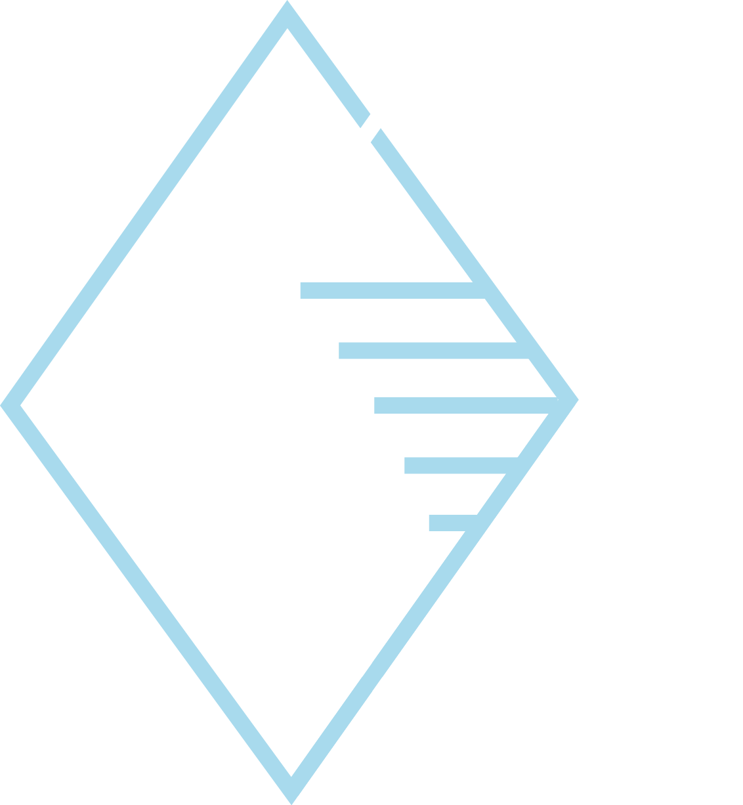

<!-- Banner -->
<section id="banner" class="major">
	

		<header class="major">
			<!-- <h1>{{ page.landing-title }}</h1> -->
			
		</header>
		

			
{{ site.description }}

			<ul class="actions">
				<li><a href="#one" class="button next scrolly">Get Started</a></li>
			</ul>
		

	

</section>

<!-- Main -->

<!-- One -->


<!-- Two -->

<section id="two">
	

		<header class="major" align='center'><b>JEST</b>
		</header>
		
<b>Junior Enterprise for Science and Technology </b> is born from the interest in learning while working and the will to do so.  A project rooted in the 'Faculdade de Ciências e Tecnologia da Universidade de Coimbra', is fueled by students of this Faculty, from the University of Coimbra. As goals, stand high the development of personal and professional skills by all its members, as well as the dynamic and productive interaction with the business and scientific fields in the area of Coimbra. Furthermore, there is a commitment to continually evolve and understand the environment in which JEST is included, in order to assess where it can put in practice its projects, as well as relating to other entities in order to provide services.  Centered in Data Science, offering services in experimental design, data analysis, as well as many other relevant fields, related to these, JEST hopes to contribute positively to both the entities it relates to and its members.
			

		<ul class="actions">
			<!-- <li><a href="landing.html" class="button next">Get Started</a></li> -->
		</ul>
	

</section>

