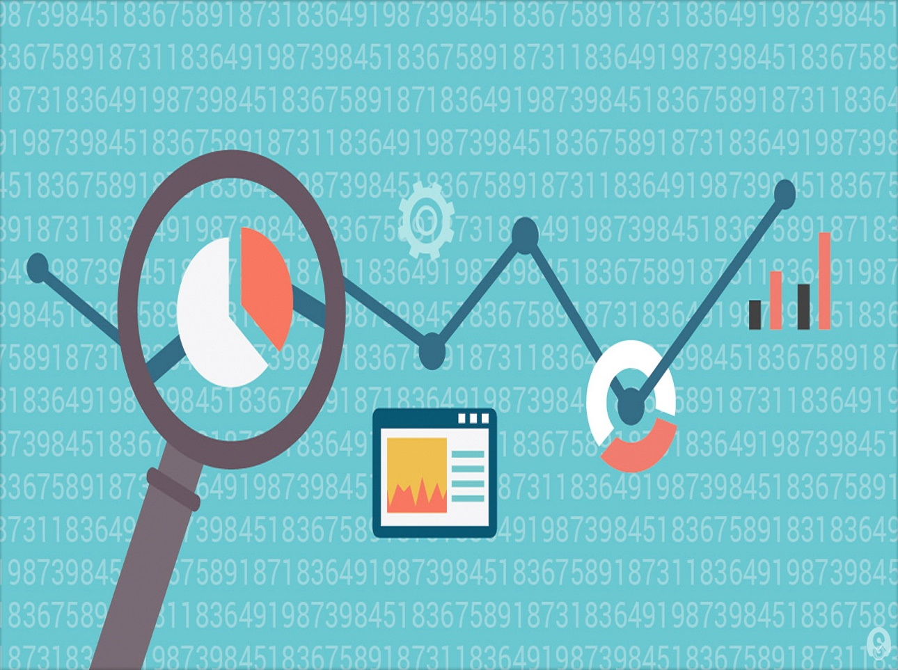

<!-- Banner -->
<!-- Note: The "styleN" class below should match that of the header element. -->
<section id="banner" class="style2">
	

		
			
		
		<header class="major">
			<h1>Services</h1>
		</header>
		

			
{{ page.description }}

		

	

</section>

<!-- Main -->

<!-- One -->
<section id="one">
	

		<header class="major">
			<h2>Services</h2>
					</header>
			
The <b>Junior Enterprise for Science and Technology </b> aims at providing efficient and reliable services. Ranging from Data Science to Event Organization, it keeps the focus on supporting the relationships between the students, the University and the various streams of professional endeavours that might interest its members.   When possible, JEST will also play cards on investigation fields, having ambition on both science participation and pedagogic formation.
			

<!-- Two -->
<section id="two" class="spotlights">
	<section>
		
		

			

				<header class="major">
					<h3>Analysis</h3>
				</header>
				
Data Science Services 
				Machine Learning and Data Mining  
				Social Networking Assessment 
				Results interpretation 
				Results Visualization for research and communication purposes 
				Research programming and use of advanced statistical software packages (e.g., Python and R) 

				<ul class="actions">
					<li><a href="generic.html" class="button">Learn more</a></li>
				</ul>
			

		

	</section>
	<section>
		
		

			

				<header class="major">
					<h3>Consulting</h3>
				</header>
				
Research design 
					Data Systematization and Organization 
					Data Team Sharing 
					Experimental Design 
					New and emerging research software packages and tools 

				<ul class="actions">
					<li><a href="generic.html" class="button">Learn more</a></li>
				</ul>
			

		

	</section>
	<section>
		
		

			

				<header class="major">
					<h3>Event Organization</h3>
				</header>
				
Scientific Meetings 
					Field targeted workshops 
					Students’ Academic Events: support and organization 

				<ul class="actions">
					<li><a href="generic.html" class="button">Learn more</a></li>
				</ul>
			

		

	</section>
	
